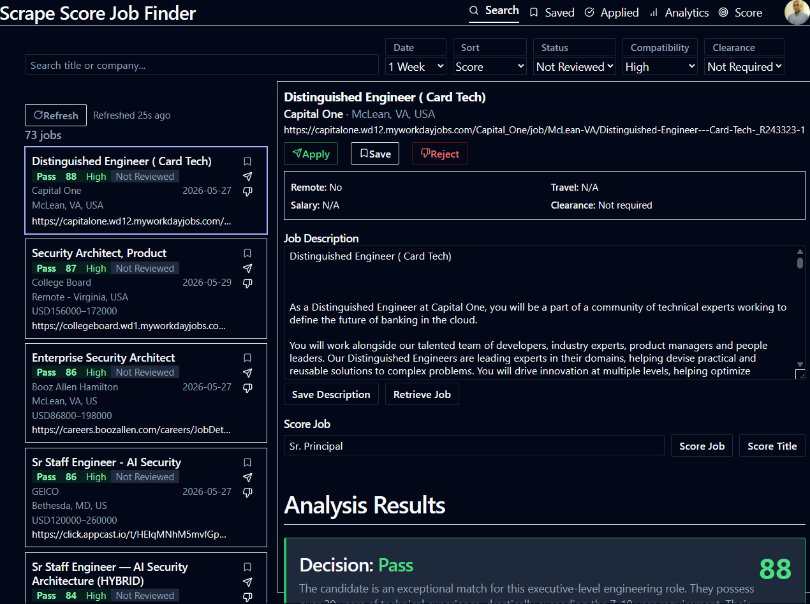

# ScrapeScore

**Disclaimer**: This is a prototype project and not production ready. Use at your own risk.

Mostly vibe-coded personal job search dashboard built with FastHTML + MonsterUI. Scrapes job boards, scores postings using AI against your resume and role preferences, and tracks applications through the full pipeline.

Project leverages a somewhat modified [JobSpy](https://github.com/cullenwatson/JobSpy) which was an excellent starting point for a lot of the scraping efforts. 

The AI scoring mechanism was very expensive in estimation due to upwards of 50Kb of prompt text being processed. I wrote a gemini ai scraper as a sibling project which uses redis for queuing request.

The system is setup on a linux server with xvfb, fluxbox and x11vnc so that I can see the browser execution of gemini for debugging. You don't have to run it with headless=False most of the time or at all.



---

## Prerequisites

- Python 3.12+ with [uv](https://docs.astral.sh/uv/)
- Google Cloud project with OAuth 2.0 credentials (for sign-in)
- A Gemini API key (for AI title compatibility scoring)

---

## First-time setup

### Prerequisites:
This project is paired with `gemini_ai_runner` project which brokers the AI using Gemini Web (poor man's llm compromise).
Project is here [https://github.com/venkman69/gemini\_ai\_runner](https://github.com/venkman69/gemini_ai_runner)

### 1. Configure environment

Create a `.env` file in the project root:

```
# if you want to scan usajobs.gov then add the api key here
USAJOBS_API_KEY=<get an api key from usajobs.gov if you want it to scan>
# this is for the gemini_ai_runner queue which uses redis
# other redis properties are in config.yaml
REDIS_PASSWORD=<if you have setup a redis instance with password then add it here>
```
Modify `config.yaml` to your spec. Key items:
* redis host, port and db
* Scrape Score application port
* Scrape Score `base_url_prefix` - if you needed to run in reverse proxy environment.
    * **NOTE**: This must match google OAuth setup.
* `site_names`: are the sites that the `job_finder.py` will scrape in each run.

### 2. Google OAuth credentials

1. Go to [Google Cloud Console](https://console.cloud.google.com/) → Credentials → Create OAuth 2.0 Client ID
2. Application type: **Web application**
3. Add authorised redirect URI: `http://localhost:8507/scrapescore/redirect`
4. Download the JSON file and save it to the default location: `./work/job_finder/client_secret.json`
5. If you chose a different location then set the path in `config.yaml`:
   ```yaml
   google_oauth_secrets_path: ./work/job_finder/client_secret.json
   ```

### 3. Chrome profile for Playwright scraping (optional)

A chrome browser data directory where you have authenticated to google and other job sites is recommended for better chance of not getting blocked.

Some scrapers use/require Playwright with an authenticated Chrome session for access.

```bash
# Linux
# assuming it is from the project folder
/opt/google/chrome/chrome --user-data-dir=./work/google_profile

# Windows (MSYS2)
start chrome.exe --user-data-dir="C:/msys64/home/<username>/<git cloned dir>/work/google_profile"
```

Sign in to Google, then close the browser. The scraper will reuse this session.
You can also sign in to linkedin, indeed and any other sites that you may want to scrape. 

---

## Launching the app

```bash
./bin/run_job_score.sh
```

Then open [http://localhost:8507](http://localhost:8507) (or port per config.yaml) and sign in with Google.

---

## Running the scraper

The scraper reads keywords and scraper configuration from your profile (set up via the **Config** menu in the app).
Other attributes are in config.yaml such as redis host, port and db number.

```bash
./bin/run_job_finder.sh
```

Each run:
- Scrapes configured job boards for each keyword
- Scores job titles against your role preferences (high / medium / low compatibility)
- Stores new jobs in `job_details` with the `search_term` that found them
- Logs scraping activity to `scraping_logs`

---

## Analytics

The `/analytics` page shows:

- **Keyword Quality** — for each keyword, what fraction of jobs found are high / medium / low title compatibility. Sourced entirely from `job_details.search_term` so it reflects actual scrape history, not current profile state.
- **Keyword Performance by Site** — for a selected keyword, which job boards are producing high-quality matches.
- **Source Effectiveness** — overall high-compat hit rate per job board.
- **Application Funnel** — how many high-compat jobs are available, saved, applied, or rejected.

Keyword quality data populates after the first scraper run following the `search_term` migration.

---

## Playwright tests

Tests that need an authenticated session use `tests/session_helper.py`, which loads your session cookie from `.sesskey`:

```python
from tests.session_helper import add_session_cookie

with sync_playwright() as p:
    browser = p.chromium.launch()
    ctx = browser.new_context()
    add_session_cookie(ctx)
    page = ctx.new_page()
```

The `.sesskey` file (git-ignored) holds your OAuth `session_` cookie value. Copy it from your browser's DevTools after signing in, or let the app create it. Falls back to `/api/test-auth` (synthetic test user) when the file is absent.

---

## Project layout

```
src/
  job_score/     # FastHTML app (routes, UI, DB queries)
  jobspy/           # Job board scrapers (LinkedIn, Indeed, Workday, …)
bin/
  run_functions.sh  # functions to setup uv and .venv etc.
  run_job_finder.sh # Scraper runner
  run_job_score.sh  # Job Finder UI launcher
work/
  job_finder/       # SQLite database (job_finder.db)
  google_profile/   # Chrome profile for Playwright scraping
```
